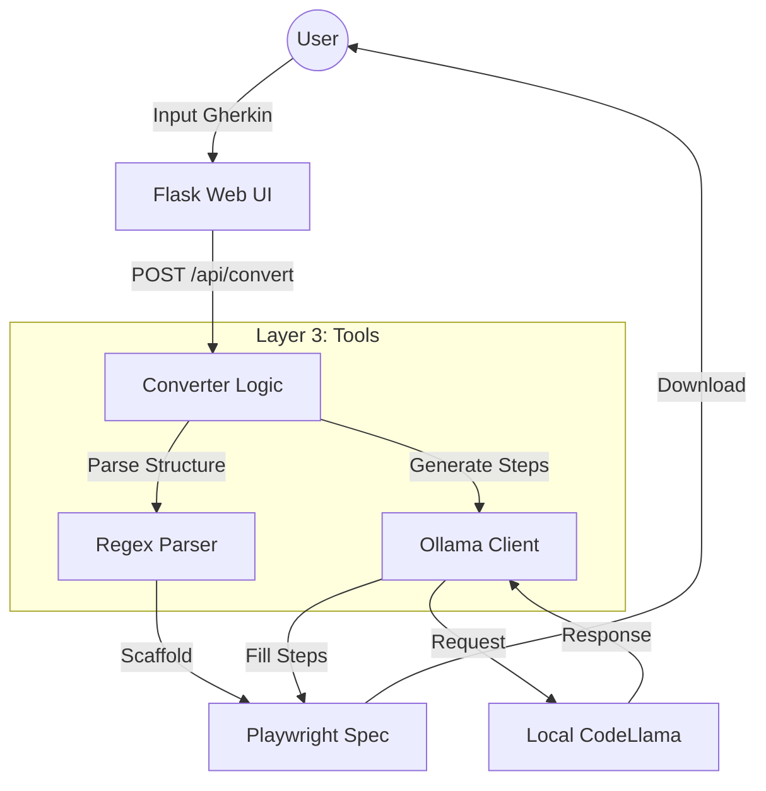

# 🚀 Gherkin to Playwright Converter (B.L.A.S.T. Protocol)

A deterministic, strictly typed **Gherkin to Playwright (TypeScript)** converter powered by **Local LLMs (Ollama/CodeLlama)** and built on the **A.N.T. Architecture**.


---

## 🏗️ Architecture

The system uses a 3-layer architecture (`A.N.T.`) to ensure reliability:



- **Layer 1 (Architecture):** SOPs define how Gherkin maps to Playwright.
- **Layer 2 (Navigation):** Python logic routes parsing vs. generation tasks.
- **Layer 3 (Tools):** `llm_client.py` and `convert_gherkin.py` handle the heavy lifting.

---

## ⚡ Quick Start

### Prerequisites
- **Python 3.12+**
- **Ollama** installed and running (`ollama serve`).
- **CodeLlama Model**: Run `ollama pull codellama`.

### Installation
1. Clone the repository:
   ```bash
   git clone https://github.com/msuman3ikp-AI/AI_Test_BluePrint.git
   ```
2. Install dependencies:
   ```bash
   pip install flask requests
   ```

### Usage
1. **Double-click** `start_server.bat` in the project folder.
2. Open your browser to **[http://localhost:5000](http://localhost:5000)**.
3. Paste your Gherkin feature file and click **Convert**.

---

## 🛠️ Project Structure

```text
├── architecture/         # Layer 1: SOPs and logic definitions
├── tools/
│   ├── app.py            # Flask Server & UI
│   ├── convert_gherkin.py# Core conversion logic
│   └── llm_client.py     # Robust Ollama wrapper
├── start_server.bat      # Windows launcher
└── README.md             # This file
```

## 🤝 Contribution
Follow the **B.L.A.S.T.** protocol:
1. **Blueprint** first (plan in `task_plan.md`).
2. **Link** check (verify connections).
3. **Architect** (update SOPs).
4. **Stylize** (UI/Output).
5. **Trigger** (Deploy).
