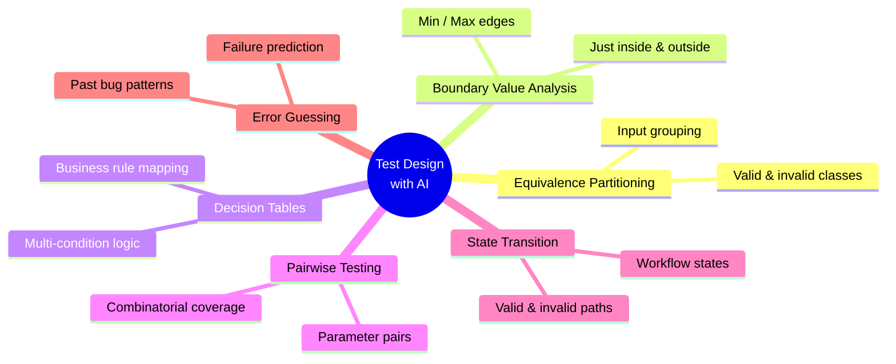
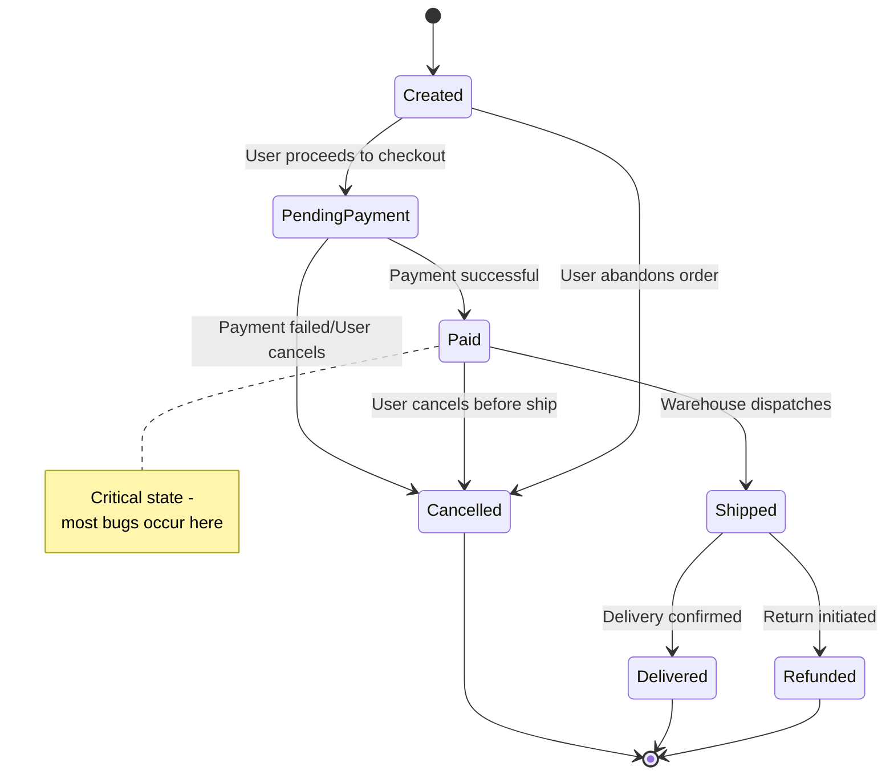

# AI-Generated Test Design

- **Author:** Pramod Dutta
- **Role:** Principal SDET
- **Website:** [The Testing Academy](https://thetestingacademy.com/)
- **LinkedIn:** [linkedin.com/in/pramoddutta](https://www.linkedin.com/in/pramoddutta/)

---

> Test design is where strategy becomes actionable test cases. AI applies classic techniques — equivalence partitioning, boundary value analysis, decision tables — at scale and speed no manual process can match.

---

## What You Already Know (Building on Previous Chapters)

| Chapter | Knowledge Used Here |
|---------|---------------------|
| **Chapter 1** | Anti-hallucination rules — verify every AI-generated test case |
| **Chapter 2** | RICE POT framework — structure prompts for test design |
| **Chapter 3** | Tools (Claude, Copilot, VS Code) — where to run these prompts |

---

## Classic Test Design Techniques + AI



| Technique | Manual Effort | AI Advantage |
|-----------|---------------|--------------|
| Equivalence Partitioning | High | Identifies all partitions automatically |
| Boundary Value Analysis | Medium | Calculates boundaries instantly |
| Decision Tables | Very High | Generates complex condition combinations |
| Pairwise Testing | Very High | Handles combinatorial explosion |
| State Transition | High | Maps all states and transitions |
| Error Guessing | Medium | Learns from past bug patterns |

---

## Technique 1: Equivalence Partitioning with AI

### What It Is

Group inputs into classes where every input in a class behaves the same way. Test one value per class.

### AI Prompt (RICE POT)

```text
Role: Test Design Engineer specializing in equivalence partitioning

Intent: Identify all equivalence classes for the given input field

Context:
- Field: Age field in user registration form
- Rules: Must be a number, minimum 18, maximum 120
- Input type: Text field (user can type anything)

Expected Output: Complete equivalence partition table

Parameters:
- Include both valid and invalid partitions
- Cover boundary adjacent values
- Include special input types (text, symbols, spaces)

Output Format:
| Partition ID | Class | Representative Value | Expected Behavior |

Task: Generate all equivalence partitions now.
```

### AI Output

| Partition ID | Class | Representative Value | Expected Behavior |
|--------------|-------|---------------------|-------------------|
| EP-01 | Valid age | 25 | Accepted |
| EP-02 | Age below minimum | 17 | Rejected: "Must be 18+" |
| EP-03 | Age above maximum | 121 | Rejected: "Must be 120 or below" |
| EP-04 | Non-numeric input | "abc" | Rejected: "Must be a number" |
| EP-05 | Negative number | -5 | Rejected: "Must be positive" |
| EP-06 | Decimal number | 25.5 | Rejected: "Must be whole number" |
| EP-07 | Empty input | "" | Rejected: "Age is required" |
| EP-08 | Zero | 0 | Rejected: "Must be 18+" |
| EP-09 | Special characters | "@#$" | Rejected: "Must be a number" |
| EP-10 | Whitespace only | "   " | Rejected: "Age is required" |
| EP-11 | Very large number | 999999 | Rejected: "Must be 120 or below" |
| EP-12 | Float at boundary | 18.0 | Depends on implementation |

---

## Technique 2: Boundary Value Analysis with AI

### AI Prompt

```text
Role: Test Design Engineer

Intent: Generate boundary value test cases

Context:
- Feature: Password field in registration
- Rules:
  - Minimum length: 8 characters
  - Maximum length: 64 characters
  - Must contain: 1 uppercase, 1 lowercase, 1 number, 1 special char

Expected Output: All boundary values and test cases

Output Format:
| BV-ID | Boundary | Test Value | Length | Expected Result |

Task: Generate complete boundary analysis.
```

### AI Output

| BV-ID | Boundary | Test Value | Length | Expected Result |
|-------|----------|------------|--------|-----------------|
| BV-01 | Below min | "Ab1@" | 4 | Rejected |
| BV-02 | At min - 1 | "Ab1@cde" | 7 | Rejected |
| BV-03 | At min | "Ab1@cdef" | 8 | Accepted |
| BV-04 | At min + 1 | "Ab1@cdefg" | 9 | Accepted |
| BV-05 | At max - 1 | [63 valid chars] | 63 | Accepted |
| BV-06 | At max | [64 valid chars] | 64 | Accepted |
| BV-07 | Above max | [65 valid chars] | 65 | Rejected |
| BV-08 | No uppercase | "ab1@cdef" | 8 | Rejected |
| BV-09 | No lowercase | "AB1@CDEF" | 8 | Rejected |
| BV-10 | No number | "Abcd@efg" | 8 | Rejected |
| BV-11 | No special char | "Ab1cdefg" | 8 | Rejected |

---

## Technique 3: Decision Tables with AI

### When to Use

Decision tables are best for features with **multiple conditions and combinations**:
- Discount calculation (membership + coupon + quantity)
- Access control (role + permission + resource)
- Shipping cost (weight + distance + express flag)

### AI Prompt

```text
Role: Test Design Engineer specializing in decision tables

Intent: Generate a complete decision table for discount calculation

Context:
Business Rules:
- Premium members get 10% discount
- Coupon code "SAVE20" gives 20% discount
- Order quantity >= 5 gives 5% discount
- Discounts are NOT cumulative (highest discount applies)
- Minimum order value: $50

Expected Output: Decision table with all condition combinations

Output Format:
| Rule | Member Type | Coupon Code | Quantity | Order Value | Discount | Final Price |

Task: Generate the complete decision table.
```

### AI Output

| Rule | Member Type | Coupon | Qty >= 5 | Order >= $50 | Applicable Discounts | Final Discount | Reasoning |
|------|-------------|--------|----------|--------------|---------------------|----------------|-----------|
| R1 | Premium | SAVE20 | Yes | Yes | 10%, 20%, 5% | **20%** | Coupon (20%) is highest |
| R2 | Premium | SAVE20 | No | Yes | 10%, 20% | **20%** | Coupon (20%) > Member (10%) |
| R3 | Premium | None | Yes | Yes | 10%, 5% | **10%** | Member (10%) > Qty (5%) |
| R4 | Premium | None | No | Yes | 10% | **10%** | Member discount only |
| R5 | Regular | SAVE20 | Yes | Yes | 20%, 5% | **20%** | Coupon (20%) > Qty (5%) |
| R6 | Regular | SAVE20 | No | Yes | 20% | **20%** | Coupon discount only |
| R7 | Regular | None | Yes | Yes | 5% | **5%** | Qty discount only |
| R8 | Regular | None | No | Yes | None | **0%** | No discount qualifies |
| R9 | Any | Any | Any | No | N/A | **0%** | Order below $50 minimum |

### Test Cases Derived from Decision Table

```
TC-DT-001: Premium + SAVE20 + Qty=6 + Order=$100 → Verify 20% applied (not 10% or 5%)
TC-DT-002: Premium + No coupon + Qty=3 + Order=$60 → Verify 10% applied
TC-DT-003: Regular + SAVE20 + Qty=10 + Order=$200 → Verify 20% applied (not 5%)
TC-DT-004: Regular + No coupon + Qty=1 + Order=$30 → Verify 0% (no discount)
TC-DT-005: Premium + SAVE20 + Qty=2 + Order=$40 → Verify 0% (below minimum)
TC-DT-006: Edge: Premium + SAVE20 + Qty=5 (exactly) + Order=$50 (exactly) → Verify 20%
```

---

## Technique 4: Pairwise Testing with AI

### Why Pairwise?

Testing all combinations of inputs is exponential. Pairwise covers every pair of inputs with far fewer test cases.

### AI Prompt

```text
Generate pairwise test cases for login feature:

Parameters:
- Browser: Chrome, Firefox, Safari
- OS: Windows, Mac, Linux
- User Type: Admin, Regular, Guest
- Login Method: Email, SSO, OAuth

Full combinations: 3×3×3×3 = 81 test cases
Pairwise target: ~20-25 test cases

Generate the pairwise matrix covering all parameter pairs.
```

### AI Output

```
PAIRWISE TEST MATRIX (24 test cases covering all pairs):

| TC# | Browser | OS | User Type | Login Method |
|-----|---------|------|-----------|--------------|
| 1 | Chrome | Windows | Admin | Email |
| 2 | Chrome | Mac | Regular | SSO |
| 3 | Chrome | Linux | Guest | OAuth |
| 4 | Firefox | Windows | Regular | OAuth |
| 5 | Firefox | Mac | Guest | Email |
| 6 | Firefox | Linux | Admin | SSO |
| 7 | Safari | Windows | Guest | SSO |
| 8 | Safari | Mac | Admin | OAuth |
| 9 | Safari | Linux | Regular | Email |
... (24 total — all pairs covered)
```

---

## Technique 5: State Transition Testing with AI

### AI Prompt

```text
Map all states and transitions for an order management system:

Order States: Created, Pending Payment, Paid, Shipped, Delivered, Cancelled, Refunded

Define:
1. All valid transitions
2. All invalid transitions
3. Test cases for each transition
4. Edge cases (e.g., cancel after shipping)
```

### AI Output



**VALID TRANSITIONS (Test All):**
| From | To | Trigger | Test Priority |
|------|-----|---------|--------------|
| Created | Pending Payment | User proceeds to checkout | High |
| Pending Payment | Paid | Payment successful | Critical |
| Pending Payment | Cancelled | Payment failed / User cancels | High |
| Paid | Shipped | Warehouse dispatches | High |
| Paid | Cancelled | User cancels before ship | Medium |
| Shipped | Delivered | Delivery confirmed | High |
| Shipped | Refunded | Return initiated | Medium |

INVALID TRANSITIONS (Test for Rejection):
| From | To | Expected |
|------|-----|----------|
| Created | Shipped | Blocked: must pay first |
| Delivered | Shipped | Blocked: already delivered |
| Cancelled | Paid | Blocked: order cancelled |
| Refunded | Shipped | Blocked: already refunded |
```

---

## Technique 6: Error Guessing with AI

### What It Is

AI predicts likely bugs based on common patterns and past failures.

### AI Prompt

```text
Based on common bugs in e-commerce applications, predict likely errors for:

Module: Payment Processing (Stripe)

Common bug patterns:
- Race conditions in payment confirmation
- Double charges on timeout retry
- Currency conversion errors
- Session expiry during payment

Generate test cases targeting these error patterns.
```

### AI Output

```
ERROR GUESSING TEST CASES:

EG-01: Double charge on network timeout
  Steps: Initiate payment → simulate timeout → retry
  Expected: Only ONE charge processed

EG-02: Payment status not updated on callback failure
  Steps: Payment succeeds → Stripe callback fails
  Expected: Order shows correct status after retry

EG-03: Currency mismatch
  Steps: Browse in EUR → checkout in USD → pay
  Expected: Consistent currency throughout

EG-04: Session expires mid-payment
  Steps: Start checkout → wait 30 min → submit payment
  Expected: Clear error, data preserved, re-auth option

EG-05: Concurrent same-user payment
  Steps: Open checkout in 2 tabs → pay in both
  Expected: Only first payment processed, second blocked
```

---

## Combining Techniques: Full Test Design Workflow

```text
PROMPT: Design a complete test suite for [feature] using:
1. Equivalence partitioning for input validation
2. Boundary value analysis for numeric fields
3. Decision tables for business rules
4. State transitions for workflow states
5. Error guessing for critical failure scenarios

Organize output by:
- Priority (Critical first)
- Test type (Positive, Negative, Edge)
- Automation feasibility (Easy to Automate / Needs Manual)
```

---

## Anti-Hallucination Rules (Chapter 1 Reference)

- [ ] Every test case traces back to a requirement
- [ ] Boundary values match actual system constraints
- [ ] Decision table rules match documented business rules
- [ ] State transitions verified against system design docs
- [ ] Error guessing cases reviewed by dev team

---

## Next Steps

- Generate [Automation Code](../automation_code_generation/ch_04_automation_code_generation.md) for designed test cases
- File bugs using [Bug Report Generation](../documentation_metrics/ch_04_bug_report_generation.md)
- Track coverage with [Test Metrics](../documentation_metrics/ch_04_test_metrics_with_ai.md)
