# Claude Code for QA & Automation

- **Author:** Pramod Dutta
- **Role:** Principal SDET
- **Website:** [The Testing Academy](https://thetestingacademy.com/)
- **LinkedIn:** [linkedin.com/in/pramoddutta](https://www.linkedin.com/in/pramoddutta/)

---

> Claude Code turns your terminal into a full QA automation lab. This is a practical end-to-end walkthrough: from raw requirements to running Playwright tests — all from the command line.

---

## What You Already Know (Building on Previous Chapters)

| Chapter | Knowledge Used Here |
|---------|---------------------|
| **Chapter 1** | Anti-hallucination rules — verify all generated code before running |
| **Chapter 2** | RICE POT framework — structure your prompts inside Claude Code |
| **Chapter 3** | [Claude Code Setup](../../chapter_03_essential_ai_tools_setup/ide_integrations/ch_03_claude_code_setup.md) — install and authenticate |

---

## Prerequisites

```bash
# Ensure these are installed
node --version       # 18+
python --version     # 3.9+
pip install playwright pytest pytest-playwright
playwright install
npm install -g @anthropic-ai/claude-code
```

---

## The Complete Walkthrough: Requirements → Running Tests

```mermaid
flowchart LR
    subgraph Phase1["🏗️ Phase 1"]
        A[Project Setup]
    end
    subgraph Phase2["📋 Phase 2"]
        B[Requirement<br/>Analysis]
    end
    subgraph Phase3["🎯 Phase 3"]
        C[Test Design]
    end
    subgraph Phase4["💻 Phase 4"]
        D[Code<br/>Generation]
    end
    subgraph Phase5["▶️ Phase 5"]
        E[Run & Debug]
    end
    subgraph Phase6["📊 Phase 6"]
        F[Report]
    end

    A --> B --> C --> D --> E --> F
    E -.->|"Fix failures"| D

    style Phase1 fill:#e3f2fd
    style Phase2 fill:#fff3e0
    style Phase3 fill:#f3e5f5
    style Phase4 fill:#e8f5e9
    style Phase5 fill:#ffebee
    style Phase6 fill:#e0f7fa
```



| Phase | What Happens | Claude Code Action |
|-------|-------------|-------------------|
| **1. Project Setup** | Create folder structure | Creates files + directories |
| **2. Requirement Analysis** | Extract testable scenarios | Analyzes PRD, lists scenarios |
| **3. Test Design** | Design detailed test cases | Generates test case document |
| **4. Code Generation** | Write Playwright code | Creates Page Objects + tests |
| **5. Run & Debug** | Execute and fix failures | Runs pytest, fixes errors |
| **6. Report** | Generate summary | Creates execution report |

---

## Phase 1: Project Setup

### Start Claude Code

```bash
mkdir qa-automation-project
cd qa-automation-project
claude
```

### Ask Claude Code to Set Up the Project

```text
> Set up a Playwright test automation project with:
  - Python with pytest
  - Page Object Model structure
  - conftest.py with browser fixtures
  - A sample test file
  - requirements.txt
  - pytest.ini configuration

Create the following directory structure:
  /tests
    /pages      (Page Objects)
    /api        (API test helpers)
    /e2e        (End-to-end tests)
    conftest.py
  requirements.txt
  pytest.ini
```

### What Claude Code Creates

```
qa-automation-project/
├── tests/
│   ├── pages/
│   │   ├── __init__.py
│   │   └── base_page.py
│   ├── api/
│   │   ├── __init__.py
│   │   └── api_client.py
│   ├── e2e/
│   │   ├── __init__.py
│   │   └── test_sample.py
│   └── conftest.py
├── requirements.txt
└── pytest.ini
```

---

## Phase 2: Requirement Analysis

### Feed Requirements to Claude Code

```text
> Analyze these requirements and extract testable scenarios:

  Feature: User Registration
  - User can register with name, email, password
  - Email must be unique and valid format
  - Password: min 8 chars, 1 uppercase, 1 number, 1 special
  - On success: show "Welcome" page, send confirmation email
  - On failure: show specific validation errors
  - Rate limit: max 5 registration attempts per hour per IP

  Output:
  1. Testable scenarios (with IDs)
  2. Ambiguities
  3. Acceptance criteria (GIVEN-WHEN-THEN)
```

### Claude Code Output

```
TESTABLE SCENARIOS:
  SC-001: Register with all valid fields → Success
  SC-002: Register with existing email → Error "Email already exists"
  SC-003: Register with invalid email format → Validation error
  SC-004: Register with password < 8 chars → Validation error
  SC-005: Register with password missing uppercase → Validation error
  SC-006: Register with password missing number → Validation error
  SC-007: Register with password missing special char → Validation error
  SC-008: Register with empty name → Validation error
  SC-009: 6th registration attempt within 1 hour → Rate limited (429)
  SC-010: Confirmation email sent on success → Verify via API

AMBIGUITIES:
  1. Name field: max length? Special characters allowed?
  2. Email: case sensitive? (john@test.com vs John@Test.com)
  3. Rate limit: per IP or per email?

Created file: tests/scenarios/registration_scenarios.md
```

---

## Phase 3: Test Design

```text
> Based on the scenarios we identified, design detailed test cases
  for user registration.

  Include:
  - Boundary values for password length
  - Equivalence partitions for email formats
  - Error message verification
  - State after successful registration

  Write test cases to: tests/design/test_registration_design.md
```

### Claude Code Creates Detailed Test Cases

```
Created tests/design/test_registration_design.md

TEST CASES DESIGNED:
  TC-001: Valid registration (happy path)
  TC-002: Email format validation (6 equivalence classes)
  TC-003: Password boundary tests (7 chars, 8 chars, 9 chars)
  TC-004: Password complexity (4 missing component tests)
  TC-005: Duplicate email detection
  TC-006: Rate limiting (5 valid + 6th blocked)
  TC-007: Empty/missing field validation (3 fields)

  Total: 18 test cases designed
```

---

## Phase 4: Code Generation

### Generate Page Object

```text
> Create a Page Object for the registration page at /register

  Fields:
  - Name input (#name)
  - Email input (#email)
  - Password input (#password)
  - Confirm password input (#confirm-password)
  - Register button (button.register-btn)
  - Error messages (.error-message)
  - Success message (.success-message)

  Write to: tests/pages/registration_page.py
```

### Generate Test File

```text
> Generate Playwright pytest tests for user registration
  using the RegistrationPage page object we created.

  Cover these scenarios:
  - TC-001: Valid registration
  - TC-002: Invalid email formats
  - TC-003: Password boundary (7, 8, 9 chars)
  - TC-004: Password complexity validation
  - TC-005: Duplicate email

  Use:
  - pytest.mark.parametrize for data-driven tests
  - Async Playwright
  - Clear assertion messages
  - The fixtures from conftest.py

  Write to: tests/e2e/test_registration.py
```

### Claude Code Generates

```python
# tests/pages/registration_page.py
"""Page Object for User Registration."""
from playwright.sync_api import Page, expect


class RegistrationPage:
    """Page Object for /register page."""

    def __init__(self, page: Page):
        self.page = page
        self.name_input = page.locator('#name')
        self.email_input = page.locator('#email')
        self.password_input = page.locator('#password')
        self.confirm_password_input = page.locator('#confirm-password')
        self.register_button = page.locator('button.register-btn')
        self.error_message = page.locator('.error-message')
        self.success_message = page.locator('.success-message')

    def navigate(self):
        self.page.goto('/register')

    def fill_form(self, name: str, email: str, password: str, confirm: str = None):
        self.name_input.fill(name)
        self.email_input.fill(email)
        self.password_input.fill(password)
        if confirm is None:
            confirm = password
        self.confirm_password_input.fill(confirm)

    def submit(self):
        self.register_button.click()

    def get_error(self) -> str:
        expect(self.error_message).to_be_visible()
        return self.error_message.inner_text()

    def is_success(self) -> bool:
        return self.success_message.is_visible()
```

```python
# tests/e2e/test_registration.py
"""Tests for user registration using sync Playwright API."""
import pytest
from playwright.sync_api import Page, expect
from tests.pages.registration_page import RegistrationPage


def test_valid_registration(page: Page):
    """TC-001: Successful registration with valid data."""
    reg = RegistrationPage(page)
    reg.navigate()
    reg.fill_form("John Doe", "john@test.com", "Secure@123")
    reg.submit()

    assert reg.is_success(), "Expected success message after valid registration"
    expect(page).to_have_url('**/welcome')


@pytest.mark.parametrize("email", [
    "invalid",
    "@domain.com",
    "user@",
    "user@.com",
    "",
])
def test_invalid_email_formats(page: Page, email: str):
    """TC-002: Invalid email format shows validation error."""
    reg = RegistrationPage(page)
    reg.navigate()
    reg.fill_form("John", email, "Secure@123")
    reg.submit()

    error = reg.get_error()
    assert "email" in error.lower(), f"Expected email error, got: {error}"


@pytest.mark.parametrize("password,expected_error", [
    ("Ab1@cde", "Password must be at least 8 characters"),        # 7 chars (boundary)
    ("Ab1@cdef", None),                                            # 8 chars (valid boundary)
    ("Ab1@cdefg", None),                                           # 9 chars (above boundary)
])
def test_password_boundary(page: Page, password: str, expected_error: str):
    """TC-003: Password length boundary value analysis."""
    reg = RegistrationPage(page)
    reg.navigate()
    reg.fill_form("John", "john@test.com", password)
    reg.submit()

    if expected_error:
        error = reg.get_error()
        assert error == expected_error, f"Expected '{expected_error}', got '{error}'"
    else:
        assert reg.is_success(), "Valid password should succeed"


@pytest.mark.parametrize("password,expected_error", [
    ("abcd@efgh1", "Must contain at least one uppercase letter"),
    ("ABCD@EFG1", "Must contain at least one lowercase letter"),
    ("Abcdefgh@", "Must contain at least one number"),
    ("Abcdefg1", "Must contain at least one special character"),
])
def test_password_complexity(page: Page, password: str, expected_error: str):
    """TC-004: Password complexity validation."""
    reg = RegistrationPage(page)
    reg.navigate()
    reg.fill_form("John", "john@test.com", password)
    reg.submit()

    error = reg.get_error()
    assert error == expected_error, f"Expected '{expected_error}', got '{error}'"
```

> **Note:** The sync API is recommended for most test suites. pytest-playwright provides the `page` fixture automatically. Only use async API if you need advanced concurrency patterns.

---

## Phase 5: Run & Debug

### Run Tests

```text
> Run the registration tests and show me the results:
  pytest tests/e2e/test_registration.py -v
```

Claude Code executes:

```
$ pytest tests/e2e/test_registration.py -v

tests/e2e/test_registration.py::test_valid_registration PASSED
tests/e2e/test_registration.py::test_invalid_email_formats[invalid] PASSED
tests/e2e/test_registration.py::test_invalid_email_formats[@domain.com] PASSED
tests/e2e/test_registration.py::test_invalid_email_formats[user@] FAILED ⚠️
tests/e2e/test_registration.py::test_password_boundary[Ab1@cde-...] PASSED
tests/e2e/test_registration.py::test_password_boundary[Ab1@cdef-...] PASSED
...

RESULTS: 15 passed, 2 failed, 1 error
```

### Debug Failures

```text
> test_invalid_email_formats[user@] failed with:
  AssertionError: Expected email error, got: "Invalid input"

  Also test_password_boundary[Ab1@cdef-None] shows:
  TimeoutError: Waiting for success message

  Analyze and fix both failures.
```

Claude Code:

```
ANALYSIS:

1. test_invalid_email_formats[user@]:
   The error message from the app is "Invalid input" (generic)
   not "email" specific. Our assertion checks for "email" in message.
   FIX: Update assertion to accept both "email" and "invalid input"

2. test_password_boundary[Ab1@cdef]:
   8-char password "Ab1@cdef" is valid by length but the app
   requires confirm password to match. We're passing the same
   password to both fields but the timing might cause a mismatch.
   FIX: Add explicit wait after form fill before submitting.

Applying fixes...
✓ tests/e2e/test_registration.py updated
```

### Re-run After Fix

```text
> Run tests again after the fix
```

```
RESULTS: 17 passed, 0 failed ✅
All registration tests passing!
```

---

## Phase 6: Report Generation

```text
> Generate a test execution summary report for registration tests:
  - Total tests run
  - Pass/fail breakdown
  - Coverage of scenarios
  - Any gaps identified
  - Recommendations
```

```
══════════════════════════════════════════════
  TEST EXECUTION REPORT - User Registration
══════════════════════════════════════════════

Total Tests:     17
Passed:          17 (100%)
Failed:          0
Scenarios Covered: 5/7

  ✅ TC-001: Valid registration
  ✅ TC-002: Email format validation
  ✅ TC-003: Password boundary
  ✅ TC-004: Password complexity
  ✅ TC-005: Duplicate email
  ❌ TC-006: Rate limiting (not yet implemented)
  ❌ TC-007: Empty field validation (partial)

GAPS:
  1. Rate limiting test needs API-level test (not UI)
  2. TC-007 only covers email — add name and password empty tests

RECOMMENDATION:
  Add 3 more tests to achieve 100% scenario coverage.
```

---

## Claude Code Quick Commands for QA

| Task | What to Type |
|------|--------------|
| Create project | "Set up a Playwright project with POM" |
| Generate test | "Generate test for [feature]" |
| Run tests | "Run pytest tests/ -v" |
| Fix failure | "Test X failed with [error]. Fix it." |
| Add test | "Add test for [scenario] to existing file" |
| Review code | "Review tests/e2e/test_login.py for issues" |
| Generate report | "Summarize test results" |
| Refactor | "Refactor tests to reduce duplication" |

---

## Anti-Hallucination Check (Chapter 1)

- [ ] Run every generated test before trusting it
- [ ] Verify selectors match actual application
- [ ] Check URLs are real, not AI-fabricated
- [ ] Review assertion values against actual expected behavior
- [ ] Don't commit untested code to CI/CD

---

## Next Steps

- Try [Augment with Playwright](ch_04_augment_framework_overview.md) for IDE-based generation
- Practice full walkthrough in [Automation Tester Exercises](../learning_practice/ch_04_exercises_automation_tester.md)
- Set up [Test Metrics](../documentation_metrics/ch_04_test_metrics_with_ai.md) for your test results
