# Chapter 4: AI-Powered Test Design & Automation

- **Author:** Pramod Dutta
- **Role:** Principal SDET
- **Website:** [The Testing Academy](https://thetestingacademy.com/)
- **LinkedIn:** [linkedin.com/in/pramoddutta](https://www.linkedin.com/in/pramoddutta/)

---

## Overview

This chapter takes you from raw requirements to running automated tests using AI at every step. You'll learn to use AI for requirement analysis, test planning, test strategy, test design, bug reporting, metrics dashboards, and full automation code generation using Playwright, Claude Code, and Augment.

> **Core Workflow:** Requirements → Test Plan → Test Strategy → Test Design → Automation Code → Bug Reports → Metrics

---

## Contents

### 📋 Requirement Analysis (`requirement_analysis/`)

- [Requirement Analysis with AI](requirement_analysis/ch_04_requirement_analysis_with_ai.md) - Extract testable scenarios from PRDs using AI

### 📑 Test Planning (`test_planning/`)

- [Test Plan Generation](test_planning/ch_04_test_plan_generation.md) - AI-generated test plans with templates
- [Test Strategy with AI](test_planning/ch_04_test_strategy_ai.md) - Risk-based, regression, and performance strategies

### 🎯 AI Test Design (`ai_test_design/`)

- [AI-Generated Test Design](ai_test_design/ch_04_ai_generated_test_design.md) - Equivalence partitioning, boundary analysis, decision tables with AI

### 📊 Documentation & Metrics (`documentation_metrics/`)

- [Bug Report Generation](documentation_metrics/ch_04_bug_report_generation.md) - AI-powered bug reports with Jira integration
- [Test Metrics with AI](documentation_metrics/ch_04_test_metrics_with_ai.md) - Custom AI dashboards and reporting

### 💻 Automation Code Generation (`automation_code_generation/`)

- [Automation Code Generation with AI](automation_code_generation/ch_04_automation_code_generation.md) - Playwright-focused code generation
- [Claude Code for QA & Automation](automation_code_generation/ch_04_claude_code_qa_automation.md) - End-to-end walkthrough: requirements → tests → code → run
- [Augment with Automation Frameworks](automation_code_generation/ch_04_augment_framework_overview.md) - Augment + Playwright deep integration

### 📝 Learning & Practice (`learning_practice/`)

- [Exercises - QA Engineer](learning_practice/ch_04_exercises_qa_engineer.md) - Requirement analysis, test planning, strategy
- [Exercises - SDET](learning_practice/ch_04_exercises_sdet.md) - Test design, bug reports, metrics
- [Exercises - Automation Tester](learning_practice/ch_04_exercises_automation_tester.md) - Code generation, Claude Code, Augment
- [All Exercises - Solutions](learning_practice/ch_04_exercises_solutions.md) - Complete answer key for all roles

---

## Directory Structure

```text
chapter_04_ai_powered_test_design_and_automation/
├── ch_04_ai_powered_test_design_and_automation.md   # This file
│
├── requirement_analysis/
│   └── ch_04_requirement_analysis_with_ai.md
│
├── test_planning/
│   ├── ch_04_test_plan_generation.md
│   └── ch_04_test_strategy_ai.md
│
├── ai_test_design/
│   └── ch_04_ai_generated_test_design.md
│
├── documentation_metrics/
│   ├── ch_04_bug_report_generation.md
│   └── ch_04_test_metrics_with_ai.md
│
├── automation_code_generation/
│   ├── ch_04_automation_code_generation.md
│   ├── ch_04_claude_code_qa_automation.md
│   └── ch_04_augment_framework_overview.md
│
└── learning_practice/
    ├── ch_04_exercises_qa_engineer.md
    ├── ch_04_exercises_sdet.md
    ├── ch_04_exercises_automation_tester.md
    └── ch_04_exercises_solutions.md
```

---

## Key Takeaway

> **AI doesn't replace testers — it amplifies them.**
> From extracting test scenarios from ambiguous requirements to generating production-ready Playwright code, AI accelerates every phase of the testing lifecycle when guided by skilled professionals.

---

## Prerequisites

Before starting this chapter, ensure you have completed:
- [Chapter 1: Foundation Model](../chapter_01_foundation_model/ch_01_foundation_model.md) - Anti-hallucination rules
- [Chapter 2: Prompt Engineering](../chapter_02_prompt_engineering/ch_02_prompt_engineering.md) - RICE POT framework
- [Chapter 3: Essential AI Tools Setup](../chapter_03_essential_ai_tools_setup/ch_03_essential_ai_tools_setup.md) - Tools configured

---

## Role-Based Learning Paths

| Role | Start Here | Focus Areas |
|------|------------|-------------|
| **QA Engineer** | Requirement Analysis → Test Planning → Test Strategy | Process, planning, documentation |
| **SDET** | Test Design → Bug Reports → Metrics | Design techniques, tooling, dashboards |
| **Automation Tester** | Automation Code Gen → Claude Code → Augment | Code generation, frameworks, CI/CD |

---

## End-to-End Workflow

```mermaid
flowchart LR
    subgraph Planning["📋 Planning Phase"]
        A[Requirements<br/>PRD/Spec] --> B[Test Plan<br/>Generation]
        B --> C[Test Strategy<br/>with AI]
    end

    subgraph Design["🎯 Design Phase"]
        C --> D[Test Design<br/>with AI]
    end

    subgraph Execution["💻 Execution Phase"]
        D --> E[Automation<br/>Code Generation]
        E --> F[Bug Reports<br/>Jira]
    end

    subgraph Reporting["📊 Reporting Phase"]
        F --> G[Test Metrics<br/>& Dashboards]
    end

    style A fill:#e1f5fe
    style G fill:#c8e6c9
```



**Workflow Summary:**
```
Requirements → Test Plan → Strategy → Design → Automation → Bug Reports → Metrics
```

---

## Tools Used in This Chapter

| Tool | Section | Purpose |
|------|---------|---------|
| Claude / ChatGPT | All sections | Prompt-based generation |
| Playwright | Automation | Primary test framework |
| Claude Code | Automation | Terminal-based QA workflow |
| Augment | Automation | IDE-based framework generation |
| Jira | Bug Reports | Bug tracking integration |
| Python | Metrics | Custom AI dashboards |
| RICE POT | All sections | Prompt engineering framework |
