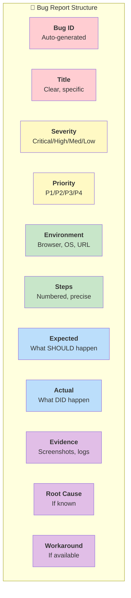
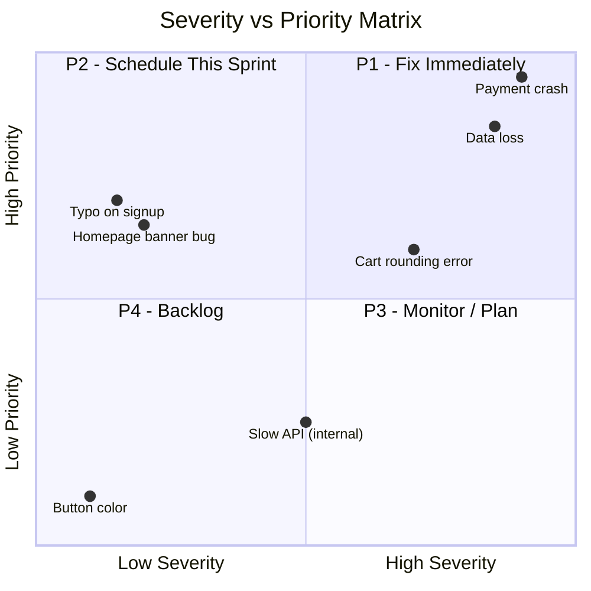

# Bug Report Generation with AI

- **Author:** Pramod Dutta
- **Role:** Principal SDET
- **Website:** [The Testing Academy](https://thetestingacademy.com/)
- **LinkedIn:** [linkedin.com/in/pramoddutta](https://www.linkedin.com/in/pramoddutta/)

---

> A good bug report saves time. A bad bug report wastes everyone's time. AI transforms vague observations into structured, actionable bug reports with proper severity, steps, and evidence.

---

## What You Already Know (Building on Previous Chapters)

| Chapter | Knowledge Used Here |
|---------|---------------------|
| **Chapter 1** | Anti-hallucination — don't fabricate steps or expected behavior |
| **Chapter 2** | RICE POT prompts — structured prompts for bug report generation |
| **Chapter 3** | Tools — use Claude, ChatGPT, or Copilot Chat for bug reports |

---

## Anatomy of a Bug Report



| Field | Description |
|-------|-------------|
| **Bug ID** | Auto-generated unique identifier |
| **Title** | Clear, specific one-line summary |
| **Severity** | Critical / High / Medium / Low |
| **Priority** | P1 (urgent) to P4 (low) |
| **Environment** | Browser, OS, URL, version |
| **Steps** | Numbered reproduction steps |
| **Expected** | What SHOULD happen |
| **Actual** | What DID happen |
| **Evidence** | Screenshots, logs, video |
| **Root Cause** | Hypothesis if known |
| **Workaround** | Temporary fix if available |

---

## Common Bug Report Mistakes

| Bad Practice | Problem | Fix |
|--------------|---------|-----|
| "Login doesn't work" | Too vague | Specify exact scenario and conditions |
| Missing steps | Can't reproduce | Number every step, include preconditions |
| No evidence | No proof | Attach screenshots, logs, network calls |
| Wrong severity | Misaligned priority | Use severity matrix |
| Missing environment | Can't reproduce | Browser, OS, version, URL |

---

## AI Bug Report Generation: RICE POT Prompt

```text
Role: Senior QA Engineer creating a detailed bug report

Intent: Convert this observation into a proper structured bug report

Context:
- Application: E-Commerce Platform
- Module: Checkout / Payment
- Environment: Chrome 120, Windows 11, Staging (https://staging.ecommerce.com)
- What happened: "Payment goes through but order status shows pending forever"
- When it happens: "Only when using Visa cards"
- Evidence: [Attach screenshot or log]

Expected Output: Complete Jira-ready bug report

Parameters:
- Classify severity based on business impact
- Suggest priority
- Add reproduction steps from the observation
- Include what to verify for fix validation
- Suggest possible root cause areas

Output Format:
## Bug Report - [BUG-ID]
### Summary, Severity, Steps, Expected, Actual, Evidence, Root Cause Hypothesis

Task: Generate the complete bug report now.
```

---

## Severity Classification Matrix

AI uses this matrix to classify severity:

| Severity | Definition | Examples |
|----------|------------|----------|
| **Critical** | System crash, data loss, security breach, payment failure | Payment double-charged, user data exposed |
| **High** | Major feature broken, no workaround | Can't complete checkout, can't reset password |
| **Medium** | Feature partially broken, has workaround | Filter not working but search works |
| **Low** | Cosmetic issue, minor inconvenience | Button misaligned, typo in text |

### Priority vs Severity



**Key Rule:** Severity doesn't always equal Priority.
- Critical bug on a rarely-used admin page → High Severity, Medium Priority
- Low severity typo on the homepage → Low Severity, High Priority (visible to every user)

---

## Example 1: Vague Observation → Full Bug Report

### Input (What Tester Says)

```
"The discount code doesn't always work. Sometimes it applies, sometimes not."
```

### AI Prompt

```text
Convert this observation into a complete bug report:

Observation: "The discount code doesn't always work. Sometimes it applies, sometimes not."

Application: E-Commerce Platform
Module: Checkout - Discount Codes
Environment: Chrome 120, Windows 11, Staging

Add:
1. Possible reproduction steps (ask what scenarios they tried)
2. Severity classification
3. Root cause hypothesis
4. Acceptance criteria for fix
5. Suggested regression test cases
```

### AI-Generated Bug Report

```markdown
## BUG-1042: Discount Code Intermittently Fails to Apply

**Severity:** High
**Priority:** P2
**Status:** Open
**Reporter:** [Your Name]
**Date:** [Today's Date]
**Environment:**
  - Browser: Chrome 120.0
  - OS: Windows 11
  - URL: https://staging.ecommerce.com/checkout
  - App Version: v2.1.3

---

### Summary
Discount code "SAVE20" intermittently fails to apply during checkout.
The code applies successfully on some attempts but shows "Invalid code"
on others without any apparent pattern.

### Steps to Reproduce
1. Add at least one item to the cart (total > $50)
2. Proceed to checkout
3. Enter discount code: SAVE20
4. Click "Apply"
5. Observe whether discount is applied

### Expected Result
Discount code "SAVE20" applies a 20% discount to the cart subtotal.
Message displayed: "Discount applied: -$X.XX"

### Actual Result
Approximately 40% of the time, the system displays:
"Invalid discount code" even though the code is valid.
No discount is applied.

### Evidence
- [Screenshot: discount_code_error.png]
- [Network tab: API response showing 400 status intermittently]

### Root Cause Hypothesis
1. Possible race condition in discount code validation API
2. Caching issue causing stale validation results
3. Database connection pool exhaustion under concurrent requests

### Workaround
Retry applying the same code — it usually works on 2nd or 3rd attempt.

### Steps to Verify Fix
1. Apply code "SAVE20" 20 consecutive times
2. All 20 attempts should succeed
3. Run concurrency test: apply code from 10 tabs simultaneously
4. All should succeed without errors

### Suggested Regression Tests
- TC-DISC-001: Apply valid code (single attempt)
- TC-DISC-002: Apply valid code under concurrent load
- TC-DISC-003: Apply expired code
- TC-DISC-004: Apply code after cart update
```

---

## Example 2: Crash Bug Report

### Input

```
"App crashes when uploading profile picture larger than 5MB"
```

### AI-Generated Bug Report

```markdown
## BUG-1043: Application Crash on Profile Picture Upload > 5MB

**Severity:** Critical
**Priority:** P1
**Status:** Open
**Environment:** Chrome 120, Windows 11, Staging

### Summary
Application throws unhandled error and crashes when user uploads
a profile picture exceeding 5MB. Page becomes unresponsive.

### Steps to Reproduce
1. Log in with any registered account
2. Navigate to Profile Settings
3. Click "Upload Photo"
4. Select an image file > 5MB (e.g., 6MB PNG)
5. Click "Upload"

### Expected Result
System displays validation error: "File size must be under 5MB.
Please choose a smaller image."

### Actual Result
Page freezes for 10+ seconds, then displays:
"Unhandled Error: Request Entity Too Large"
Browser console shows: 413 error not caught by frontend

### Evidence
- [Screenshot: crash_screenshot.png]
- [Console log: 413_error.log]
- [Test file: test_image_6mb.png]

### Root Cause Hypothesis
Frontend validation missing for file size before API call.
Backend returns 413 but frontend has no error handler for this status.

### Workaround
Upload images under 5MB only.

### Verify Fix Criteria
- Files at exactly 5MB → should upload successfully
- Files at 5.01MB → should show validation error (not crash)
- Files at 10MB, 50MB → should show validation error immediately
- Error message should be user-friendly
```

---

## Jira Integration: Automating Bug Reports

### Using AI to Create Jira-Ready Format

```text
Generate a bug report in Jira format with:
- Summary (max 100 chars)
- Description (markdown)
- Labels: [bug, severity-high, module-payment]
- Component: [Checkout]
- Assignee suggestion based on module
- Sprint: [Current Sprint]
- Steps in numbered format

Observation: [Your bug observation]
```

### Jira Template (Copy-Paste Ready)

```
h2. Bug Report

*Summary:* [One-line description]

h3. Environment
* Browser:
* OS:
* URL:
* Version:

h3. Steps to Reproduce
# Step 1
# Step 2
# Step 3

h3. Expected Result
[What should happen]

h3. Actual Result
[What actually happens]

h3. Evidence
[Attach screenshots/logs]

h3. Severity: [Critical/High/Medium/Low]
h3. Priority: [P1/P2/P3/P4]

h3. Root Cause Hypothesis
[If known]

h3. Workaround
[If available]
```

---

## Automating Bug Report Generation from Test Failures

### Playwright + AI Integration

```python
import re
from datetime import datetime

def generate_bug_report_prompt(test_name, error_message, steps, url):
    """Generate AI prompt from Playwright test failure."""
    return f"""
    Convert this test failure into a structured bug report:

    Test Name: {test_name}
    Error: {error_message}
    URL: {url}
    Steps Executed: {steps}
    Timestamp: {datetime.now()}

    Generate:
    1. Summary (one line)
    2. Severity classification
    3. Reproduction steps
    4. Expected vs Actual
    5. Root cause hypothesis
    6. Priority suggestion
    """

# Example usage after Playwright failure:
prompt = generate_bug_report_prompt(
    test_name="test_checkout_payment_visa",
    error_message="Expected 'Order Confirmed' but got 'Order Pending'",
    steps=["Add item to cart", "Proceed to checkout", "Enter Visa card", "Click Pay"],
    url="https://staging.ecommerce.com/checkout"
)
# Send prompt to Claude/ChatGPT API for bug report generation
```

---

## Bug Report Review Checklist

Before filing, verify with AI:

```text
Review this bug report and check:
1. Are steps complete and reproducible?
2. Is severity correctly classified?
3. Is evidence sufficient?
4. Are expected/actual results clearly different?
5. Is the summary clear in one line?
6. Any missing environment details?

[PASTE BUG REPORT]
```

---

## Anti-Hallucination Rules (Chapter 1)

**Critical for bug reports:**
- [ ] Steps are ACTUALLY what you did — don't let AI invent steps
- [ ] Expected behavior comes from requirements, not assumptions
- [ ] Actual behavior is what you OBSERVED, not guessed
- [ ] Severity is based on real business impact
- [ ] Root cause hypothesis is clearly marked as hypothesis

---

## Next Steps

- Track bug metrics with [Test Metrics with AI](ch_04_test_metrics_with_ai.md)
- Automate test execution with [Automation Code Generation](../automation_code_generation/ch_04_automation_code_generation.md)
- Practice bug reporting in [SDET Exercises](../learning_practice/ch_04_exercises_sdet.md)
