# Requirement Analysis with AI

- **Author:** Pramod Dutta
- **Role:** Principal SDET
- **Website:** [The Testing Academy](https://thetestingacademy.com/)
- **LinkedIn:** [linkedin.com/in/pramoddutta](https://www.linkedin.com/in/pramoddutta/)

---

> The first and most critical step before writing any test. AI helps extract testable scenarios, identify gaps, and flag ambiguities in requirements that humans often miss.

---

## What You Already Know (Building on Previous Chapters)

| Chapter | Knowledge Used Here |
|---------|---------------------|
| **Chapter 1** | Anti-hallucination rules — never assume AI output is correct without verification |
| **Chapter 2** | RICE POT framework — structure every prompt for requirement analysis |
| **Chapter 3** | Tools (Claude, ChatGPT, Gemini) — where to run these prompts |

---

## Why Requirement Analysis Matters

| Problem | Impact |
|---------|--------|
| Ambiguous requirements | Wrong tests written |
| Missing edge cases | Bugs reach production |
| Unclear acceptance criteria | No clear pass/fail definition |
| Untestable requirements | Wasted effort |

AI solves this by analyzing requirements faster and deeper than manual review.

---

## The 5-Step AI Requirement Analysis Process

```mermaid
flowchart TD
    A["📄 Step 1: Feed Requirements to AI"] --> B["🔍 Step 2: Extract Testable Scenarios"]
    B --> C["⚠️ Step 3: Identify Ambiguities & Gaps"]
    C --> D["✅ Step 4: Define Acceptance Criteria"]
    D --> E["🔄 Step 5: Validate & Refine"]
    E -.->|"Iterate if needed"| A

    style A fill:#e3f2fd
    style B fill:#fff3e0
    style C fill:#ffebee
    style D fill:#e8f5e9
    style E fill:#f3e5f5
```



---

## Step 1: Feed Requirements to AI

### What to Upload

| Document | What to Include |
|----------|-----------------|
| PRD (Product Requirements Document) | Full document or relevant sections |
| User Stories | As-is text with acceptance criteria |
| API Specs | OpenAPI/Swagger YAML or JSON |
| UI Mockups | Screenshots (use Gemini for visual) |
| Business Rules | Explicit rules and constraints |

### RICE POT Prompt Template

```text
Role: Senior QA Engineer with 10 years of experience in requirement analysis

Intent: Analyze the given requirements and extract all testable scenarios

Context:
- Application: [App Name]
- Module: [Module Name]
- Environment: [Web / Mobile / API]
[PASTE YOUR REQUIREMENTS HERE]

Expected Output:
- Testable scenarios grouped by feature
- Ambiguities flagged
- Gaps identified
- Acceptance criteria defined

Parameters:
- Include both positive and negative scenarios
- Flag any "shall" or "must" requirements separately
- Identify dependencies between features

Output Format:
## Feature: [Name]
### Testable Scenarios
| Scenario ID | Description | Type | Priority |

### Ambiguities
| # | Ambiguity | Clarification Needed |

### Gaps
| # | Missing Requirement | Suggested Addition |

Task: Perform the complete requirement analysis now.
```

---

## Step 2: Extract Testable Scenarios

### Example: E-Commerce Login Requirement

**Raw Requirement:**
> "Users shall be able to log in using their registered email and password. The system shall lock the account after failed attempts."

### AI Prompt

```text
Extract all testable scenarios from this requirement:

"Users shall be able to log in using their registered email and password.
The system shall lock the account after failed attempts."

For each scenario, provide:
1. Scenario ID
2. Description
3. Type (Positive / Negative / Edge)
4. Priority (Critical / High / Medium / Low)
5. Precondition
6. Input
7. Expected Output
```

### AI Output

| Scenario ID | Description | Type | Priority |
|-------------|-------------|------|----------|
| SC-001 | Login with valid email and password | Positive | Critical |
| SC-002 | Login with invalid password | Negative | Critical |
| SC-003 | Login with unregistered email | Negative | Critical |
| SC-004 | Login with empty email field | Negative | High |
| SC-005 | Login with empty password field | Negative | High |
| SC-006 | Account locks after 3 failed attempts | Negative | Critical |
| SC-007 | Login after account is locked | Edge | Critical |
| SC-008 | Login with case-sensitive email | Edge | Medium |
| SC-009 | Login with expired session | Edge | Medium |
| SC-010 | Login with special characters in password | Edge | Low |

---

## Step 3: Identify Ambiguities & Gaps

### Common Ambiguities AI Catches

| Ambiguity Type | Example | What AI Flags |
|----------------|---------|---------------|
| Undefined limit | "lock after failed attempts" | How many attempts? |
| Missing timeout | "session management" | Session duration? |
| Vague criteria | "user-friendly interface" | Not testable — needs specific criteria |
| Missing error messages | "invalid login" | What exact error is shown? |
| Platform scope | "mobile app" | iOS only? Android? Both? |

### Prompt for Gap Analysis

```text
Analyze these requirements for a user registration feature and identify:

Requirements:
- User can register with email and password
- Email must be unique
- Password must meet complexity requirements
- User receives confirmation email

Find:
1. Gaps - What's missing that should be specified?
2. Ambiguities - What's unclear?
3. Dependencies - What depends on what?
4. Unstated assumptions - What are we assuming?

Be thorough. Every gap is a potential production bug.
```

### Typical Gaps Found

```
GAPS IDENTIFIED:
1. Password complexity rules not defined (min length, special chars?)
2. Email confirmation link expiry time not specified
3. What happens if user registers with already confirmed email?
4. Rate limiting on registration attempts not mentioned
5. Phone number field — optional or required?

AMBIGUITIES:
1. "unique email" — case sensitive? (john@test.com vs John@Test.com)
2. "confirmation email" — what if email not received? Resend option?

DEPENDENCIES:
1. Registration depends on email service (SMTP)
2. Uniqueness check depends on database
```

---

## Step 4: Define Acceptance Criteria

### Converting Requirements to Testable Acceptance Criteria

**Bad Acceptance Criteria (Untestable):**
```
- System should be fast
- Login should work properly
- UI should look good
```

**Good Acceptance Criteria (AI-Generated):**

```text
Generate testable acceptance criteria for:
"User login with account lockout after failed attempts"

Format each criterion as:
GIVEN [precondition]
WHEN [action]
THEN [expected outcome]
```

### Output

```
AC-001:
GIVEN a registered user with valid credentials
WHEN they enter correct email and password and click Login
THEN they are redirected to the dashboard within 3 seconds

AC-002:
GIVEN a user who has failed login 3 times consecutively
WHEN they attempt to login again
THEN the account is locked and error message "Account locked. Try again after 30 minutes" is displayed

AC-003:
GIVEN a locked account
WHEN 30 minutes have passed
THEN the user can attempt to login again

AC-004:
GIVEN a user with a locked account
WHEN they click "Forgot Password" and reset password
THEN the account is unlocked and they can login with new password
```

---

## Step 5: Validate & Refine

### Validation Checklist

- [ ] Every requirement has at least one testable scenario
- [ ] All ambiguities are flagged for stakeholder clarification
- [ ] Acceptance criteria follow GIVEN-WHEN-THEN format
- [ ] No untestable requirements remain
- [ ] Priority assigned to each scenario
- [ ] Dependencies documented

### Refinement Prompt

```text
Review these acceptance criteria and:
1. Check for completeness
2. Identify any remaining ambiguities
3. Suggest additional edge cases
4. Verify GIVEN-WHEN-THEN format is correct
5. Flag any criteria that are still untestable

[PASTE ACCEPTANCE CRITERIA]
```

---

## Real-World Example: Full Walkthrough

### Input: Product Requirement

```
Feature: Shopping Cart
- Users can add products to cart
- Cart shows total price with tax
- Users can update quantity
- Users can remove items
- Cart persists across sessions (logged-in users)
- Maximum 10 items per cart
```

### AI Analysis Output

```
TESTABLE SCENARIOS: 18 identified
AMBIGUITIES: 4 found
  1. Tax calculation — percentage or fixed? Per region?
  2. "Maximum 10 items" — unique items or total quantity?
  3. Cart persistence — how long? Until order or indefinitely?
  4. What happens when adding 11th item?

GAPS: 3 identified
  1. Out-of-stock item handling not specified
  2. Price change while item in cart not addressed
  3. Cart behavior for guest users not defined

ACCEPTANCE CRITERIA: 12 generated (GIVEN-WHEN-THEN)
DEPENDENCIES: Email service, inventory API, payment gateway
```

---

## Anti-Hallucination Rules for Requirement Analysis

Follow [Chapter 1 rules](../../chapter_01_foundation_model/rules_checklists/ch_01_anti_hallucination_rules.md):

1. **Never assume** — If AI generates a scenario not in requirements, flag it
2. **Verify numbers** — Double-check any specific values AI generates
3. **Cross-reference** — Compare AI output with original requirements
4. **Stakeholder review** — Get sign-off on extracted scenarios
5. **Document sources** — Link each scenario to its requirement

---

## Next Steps

- Use analyzed requirements to create [Test Plans](../test_planning/ch_04_test_plan_generation.md)
- Define [Test Strategy](../test_planning/ch_04_test_strategy_ai.md)
- Move to [AI Test Design](../ai_test_design/ch_04_ai_generated_test_design.md) for detailed test cases
