# Test Strategy with AI

- **Author:** Pramod Dutta
- **Role:** Principal SDET
- **Website:** [The Testing Academy](https://thetestingacademy.com/)
- **LinkedIn:** [linkedin.com/in/pramoddutta](https://www.linkedin.com/in/pramoddutta/)

---

> Test strategy defines HOW testing will be carried out. AI analyzes your project context and generates a tailored strategy that prioritizes risk, maximizes coverage, and fits your constraints.

---

## What You Already Know (Building on Previous Chapters)

| Chapter | Knowledge Used Here |
|---------|---------------------|
| **Chapter 1** | Anti-hallucination rules — ensure risk assessments reflect real project context |
| **Chapter 2** | RICE POT framework — structure prompts for strategy generation |
| **Chapter 3** | Tools — use Claude/ChatGPT for strategy documents, VS Code for implementation |

---

## Test Plan vs Test Strategy

| Aspect | Test Plan | Test Strategy |
|--------|-----------|---------------|
| **Focus** | What, when, who | How, why |
| **Level** | Project-specific | Organization or release level |
| **Scope** | Single project | Can span multiple projects |
| **Changes** | Changes with project | More stable, long-term |
| **Owner** | Test Lead | QA Manager / Lead |

---

## Types of Test Strategies

| Strategy | Focus | Best For |
|----------|-------|----------|
| **Risk-Based** | Test highest-risk areas first | Complex applications |
| **Regression** | Protect existing features | Continuous delivery |
| **Exploratory** | Find unknown bugs | New features, UI testing |
| **Performance** | Speed, load, stress | High-traffic applications |
| **Security** | Vulnerabilities, compliance | Payment, healthcare apps |
| **Shift-Left** | Test early and often | DevOps, Agile teams |

---

## AI-Powered Strategy Generation

### RICE POT Prompt: Risk-Based Strategy

```text
Role: Senior QA Strategist with experience in risk-based testing

Intent: Generate a risk-based test strategy for the application

Context:
- Application: E-Commerce Platform
- Critical Modules: Authentication, Payment (Stripe), Cart
- Team Size: 3 testers, 1 automation engineer
- Release Cycle: 2-week sprints
- Previous Bugs: Payment validation failures, cart persistence issues
- Compliance: PCI-DSS for payment processing
- Tech Stack: React frontend, Node.js backend, PostgreSQL

Expected Output: Comprehensive risk-based test strategy

Parameters:
- Prioritize by risk severity and likelihood
- Include fallback plans for high-risk areas
- Align with Agile/Scrum methodology
- Include automation recommendations per risk area

Output Format:
## Risk Assessment Matrix
## Strategy per Risk Level
## Automation Roadmap
## Execution Priority

Task: Generate the complete risk-based test strategy.
```

---

## Strategy 1: Risk-Based Testing

### Risk Assessment Matrix

```
RISK ASSESSMENT MATRIX
=============================================
| Risk Area        | Severity | Likelihood | Priority | Action |
|------------------|----------|------------|----------|--------|
| Payment failure  | Critical | High       | P1       | Full automation |
| Auth bypass      | Critical | Medium     | P1       | Manual + Auto |
| Cart data loss   | High     | High       | P2       | Full automation |
| Search accuracy  | Medium   | Medium     | P3       | Manual |
| UI alignment     | Low      | High       | P4       | Visual regression |
| Performance degradation | High | Low    | P2       | Load testing |
```

### AI-Generated Risk Strategy

```text
RISK-BASED STRATEGY:

P1 - CRITICAL (Test First, Full Depth):
  → Payment: Test all payment flows including edge cases
    - Valid transactions across card types
    - Declined cards (insufficient funds, expired, invalid)
    - Timeout scenarios
    - Refund processing
    Automation: 100% of scenarios

  → Authentication: Full security testing
    - SQL injection on login fields
    - Session token manipulation
    - Concurrent session handling
    Automation: 80% functional, manual security probes

P2 - HIGH (Standard Depth):
  → Cart Persistence: Cross-session and cross-device
    - Login on one device, verify on another
    - Clear cache and verify persistence
    Automation: 90% of scenarios

  → Performance: Load testing at peak
    - 1000 concurrent users simulation
    - Cart operation under load
    Automation: Full load scripts (Playwright + k6)

P3 - MEDIUM (Smoke + Key Paths):
  → Search: Key flows and filter combinations
    Automation: Happy path only

P4 - LOW (Visual Only):
  → UI: Screenshot comparison
    Automation: Visual regression suite
```

---

## Strategy 2: Regression Testing Strategy

### When to Use

```
Regression strategy is critical for:
- After bug fixes (verify fix + no new bugs)
- After feature additions (existing features intact)
- Before releases (confidence gate)
- In continuous delivery (run every deployment)
```

### Regression Tier Structure

```mermaid
flowchart TB
    subgraph T1["⚡ TIER 1 — Smoke  |  15 min  |  Every deployment"]
        T1A[Login & Logout]
        T1B[Add to Cart & Checkout]
        T1C[Search One Product]
        T1D[Payment Success Flow]
    end

    subgraph T2["📋 TIER 2 — Core Regression  |  2 hrs  |  Every sprint"]
        T2A[Full Auth Flow]
        T2B[All Cart Operations]
        T2C[Payment Success + Top 3 Failures]
        T2D[Search + Filters]
    end

    subgraph T3["🔬 TIER 3 — Full Regression  |  Full Day  |  Every release"]
        T3A[All Scenarios incl. Edge Cases]
        T3B[Cross-Browser Matrix]
        T3C[Performance Baselines]
        T3D[Security Scan]
    end

    T1 --> T2 --> T3

    style T1 fill:#c8e6c9,stroke:#388e3c
    style T2 fill:#fff9c4,stroke:#f9a825
    style T3 fill:#ffcdd2,stroke:#e53935
```



### AI Prompt for Regression Strategy

```text
Generate a regression test strategy for:

Application: E-Commerce Platform
Release frequency: Every 2 weeks
Previous high-severity bugs:
1. Payment timeout not handled
2. Cart items lost on page refresh
3. Search results showing wrong products

Define:
1. Regression suite priority levels
2. Which tests run every sprint vs. every release
3. Automation coverage targets
4. Time allocation for regression
5. How to prioritize when time is limited
```

### AI Output

```
REGRESSION STRATEGY:

TIER 1 - Run Every Deployment (Smoke):
  Duration: 15 minutes
  Coverage: Critical paths only
  - Login & logout
  - Add to cart & checkout
  - Search one product
  - Payment success flow
  Tools: Playwright (automated)

TIER 2 - Run Every Sprint (Core Regression):
  Duration: 2 hours
  Coverage: All major features
  - Full authentication flow
  - All cart operations
  - Payment success + top 3 failure scenarios
  - Search + filter combinations
  Tools: Playwright (automated) + manual edge cases

TIER 3 - Run Every Release (Full Regression):
  Duration: Full day
  Coverage: 100% test suite
  - All scenarios including edge cases
  - Cross-browser testing
  - Performance baselines
  - Security scan
  Tools: Full automation suite + manual exploratory

PREVIOUS BUG REGRESSION (Always Run):
  - Payment timeout handling (TC-PAY-078)
  - Cart persistence on refresh (TC-CART-023)
  - Search result accuracy (TC-SEARCH-041)
```

---

## Strategy 3: Shift-Left Testing Strategy

### What is Shift-Left?


**Key Insight:** Testing moves earlier in the pipeline, catching bugs when they're cheapest to fix.

### AI Prompt

```text
Create a shift-left testing strategy for our DevOps pipeline:

Current pipeline stages:
1. Code commit
2. Build
3. Unit tests
4. Integration tests
5. Deploy to staging
6. QA testing
7. Deploy to production

Add testing activities at each stage using AI assistance.
Include: contract testing, security scanning, API mocking.
```

### Shift-Left Pipeline Visual

```mermaid
flowchart LR
    subgraph Pipeline
        S1["1️⃣ Code Commit"]:::early --> S2["2️⃣ Build"]:::early
        S2 --> S3["3️⃣ Unit Tests"]:::early
        S3 --> S4["4️⃣ Integration"]:::mid
        S4 --> S5["5️⃣ Staging"]:::mid
        S5 --> S6["6️⃣ QA Testing"]:::late
        S6 --> S7["7️⃣ Production"]:::late
    end

    A["🤖 AI Code Review"]:::label --> S1
    B["🔒 Vulnerability Scan"]:::label --> S2
    C["🧪 AI Unit Tests"]:::label --> S3
    D["📝 Contract Tests"]:::label --> S4
    E["💨 Smoke Tests"]:::label --> S5
    F["🔄 Full Regression"]:::label --> S6
    G["📡 Monitoring"]:::label --> S7

    classDef early fill:#c8e6c9,stroke:#388e3c
    classDef mid fill:#fff9c4,stroke:#f9a825
    classDef late fill:#ffcdd2,stroke:#e53935
    classDef label fill:#e3f2fd,stroke:#1976d2
```



### Output

```
SHIFT-LEFT STRATEGY:

Stage 1 - Code Commit:
  → AI-assisted code review (Copilot/Augment)
  → Static analysis for test files
  → Requirement traceability check

Stage 2 - Build:
  → Compile-time checks
  → Dependency vulnerability scan

Stage 3 - Unit Tests:
  → AI-generated unit tests (Claude Code)
  → 80% code coverage gate
  → Mutation testing

Stage 4 - Integration Tests:
  → API contract tests (Pact)
  → Database integration validation
  → Third-party mock validation (Stripe)

Stage 5 - Deploy to Staging:
  → Smoke tests (Playwright - 15 min)
  → Security scan (OWASP)

Stage 6 - QA Testing:
  → Full regression (Playwright)
  → Exploratory testing
  → Performance baseline comparison

Stage 7 - Deploy to Production:
  → Canary deployment monitoring
  → Synthetic monitoring
  → Rollback criteria defined
```

---

## Choosing the Right Strategy

### Decision Matrix

```text
Use this prompt to choose your strategy:

Given our project:
- Timeline: [X weeks]
- Team: [Y testers]
- Risk areas: [List]
- Release frequency: [Every X days/weeks]
- Previous bugs: [List critical ones]
- Automation maturity: [Low/Medium/High]

Recommend:
1. Primary test strategy
2. Secondary strategy (if time allows)
3. Automation priority areas
4. Manual testing focus areas
5. What to skip if time runs out
```

---

## Strategy Documentation Template

```markdown
# Test Strategy - [Project/Release Name]

## 1. Objective
[What we want to achieve]

## 2. Strategy Type
[Risk-Based / Regression / Shift-Left / Combined]

## 3. Risk Assessment
| Risk | Severity | Likelihood | Priority | Mitigation |

## 4. Testing Approach
### Automated Testing
- Tool: Playwright
- Coverage target: X%
- Scripts: [List]

### Manual Testing
- Focus areas: [List]
- Exploratory areas: [List]

## 5. Prioritization
| Priority | Test Areas | Automation | Manual |

## 6. Entry & Exit Criteria
[Define clearly]

## 7. Tools & Infrastructure
| Tool | Purpose | Owner |

## 8. Success Metrics
- Test coverage: X%
- Bug detection rate: X%
- Automation ratio: X%
```

---

## Anti-Hallucination Check

- [ ] Strategy aligns with actual project constraints
- [ ] Risk priorities reflect real business impact
- [ ] Tool recommendations are available in your environment
- [ ] Timeline is achievable with your team size
- [ ] Automation targets are realistic for current maturity

---

## Next Steps

- Create detailed test cases with [AI Test Design](../ai_test_design/ch_04_ai_generated_test_design.md)
- Start [Automation Code Generation](../automation_code_generation/ch_04_automation_code_generation.md)
- Set up [Bug Reporting](../documentation_metrics/ch_04_bug_report_generation.md) for issues found
